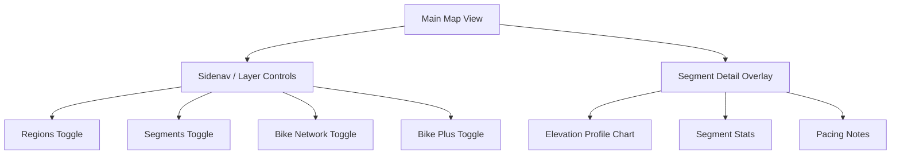
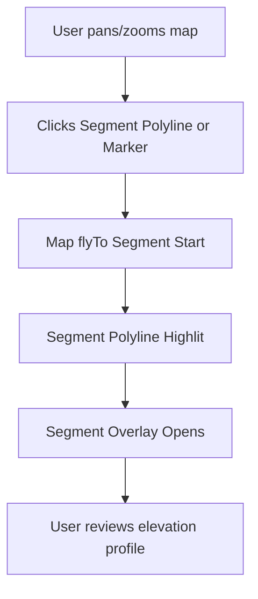

# Velopitt UI/UX Specification

## Introduction

This document defines the user experience goals, information architecture, user flows, and visual design specifications for Velopitt's user interface. It serves as the foundation for visual design and frontend development, ensuring a cohesive and user-centered experience.

### Document Scope

This specification documents the CURRENT state of the Velopitt UI/UX to ensure strict visual and interaction parity during the Angular 20+ modernization.

### UX Goals & Principles

#### Target User Personas
- **Sporty Cyclist:** Enthusiast who uses the map to find specific climbs, training routes, and segments in the Pittsburgh area.
- **Cycle Tourist:** Visitor looking for safe bike infrastructure (lanes, trails) to navigate the city.
- **Local Commuter:** Needs to understand the bike network layers (sharrows vs. protected lanes) for daily travel.

#### Usability Goals
- **Immediate Exploration:** Users can immediately see segments and infrastructure upon page load.
- **Spatial Awareness:** Smooth transitions (`flyTo`) between different areas of the city to maintain context.
- **Visual Hierarchy:** Clear distinction between "Selected" and "Unselected" map features.

#### Design Principles
1. **High Contrast** - Dark-themed map style to make colorful infrastructure layers and segments pop.
2. **Contextual Detail** - Only show complex elevation data and pacing notes when a specific segment is selected.
3. **Responsive Mapping** - Map controls and overlays must adapt to mobile vs. desktop screen real estate.

### Change Log

| Date       | Version | Description                   | Author    |
| ---------- | ------- | ----------------------------- | --------- |
| 2026-01-15 | 1.0     | Initial UI/UX Spec for Parity | UX Expert |

## Information Architecture (IA)

### Site Map / Screen Inventory

### Navigation Structure

**Primary Navigation:** Sidebar drawer containing layer toggles and links to static pages (Group Rides, Community, etc.). Accessible via a hamburger menu in the header.

**Secondary Navigation:** Map interaction. Clicking segments or markers acts as a navigation trigger to a detailed view of that entity.

**Breadcrumb Strategy:** None. The application is a single-page map experience where context is maintained spatially.

## User Flows

### Flow: Explore and Inspect Segment
**User Goal:** Find a specific climb, see its grade, and understand the pacing.

**Entry Points:** Map click, Marker click, or Sidebar search (future).

**Success Criteria:** Map flies to segment, overlay opens with elevation data.

**Edge Cases & Error Handling:**
- Clicking map background: Deselects current segment and closes overlay.
- Clicking a different segment while one is open: Smoothly transitions `flyTo` and updates overlay content.

## Component Library (Existing)

### Core Components

#### Header
- **Purpose**: Brand identification and menu trigger.
- **Variants**: Standard.
- **States**: Sticky top.

#### Map
- **Purpose**: Primary interaction surface.
- **Variants**: Custom Mapbox style.
- **States**: Interactive (panning/zooming), Loading.

#### Segment Overlay
- **Purpose**: Displaying rich metadata for a selected route.
- **Variants**: Mobile (full width/bottom), Desktop (floating card).
- **States**: Hidden, Visible.

#### Sidebar (MatDrawer)
- **Purpose**: Global settings and layer visibility.
- **Variants**: Over (Mobile), Side (Desktop - potential).
- **States**: Closed, Open.

## Branding & Style Guide

### Visual Identity
**Brand Guidelines:** Minimalist, high-tech, cycling-focused. Utilizes standard Angular Material "Dark" palette as a base.

### Color Palette

| Color Type | Hex Code / Variable | Usage |
| --- | --- | --- |
| Primary | `#d0bcff` (Standard Material) | Buttons, Highlights |
| Background | `#1c1b1f` | Sidebar and Overlay backgrounds |
| Segment Unselected | `--sys-segment-unselected` | Dimmed polylines on map |
| Segment Selected | `--sys-segment-selected` | Bright highlighted polyline |
| Marker | `--sys-marker` | Map icon color |
| Downhill | `--sys-gradient-downhill` | Elevation chart negative grade |
| Extreme Grade | `--sys-gradient-extreme` | Elevation chart >15% grade |

### Typography
- **Primary:** Roboto (Angular Material default)
- **Monospace:** Consas/Courier (for stats)

### Iconography
**Icon Library:** Material Symbols (Outlined).

## Accessibility Requirements

### Compliance Target
**Standard:** WCAG 2.1 Level AA (Target).

### Key Requirements
- **Visual:** Maintain contrast ratios for text in overlays. Ensure segment colors are distinguishable for color-blind users (Red/Green avoidance).
- **Interaction:** Keyboard navigation for sidebar toggles. Accessible labels for map markers.

## Responsiveness Strategy

### Breakpoints

| Breakpoint | Min Width | Max Width | Target Devices |
| --- | --- | --- | --- |
| Mobile | 0px | 599px | Phones |
| Tablet | 600px | 959px | Tablets, Large Phones |
| Desktop | 960px | - | Laptops, Monitors |

### Adaptation Patterns
- **Layout Changes:** Segment overlay moves from a floating card (Desktop) to a bottom sheet or full-width overlay (Mobile).
- **Navigation Changes:** Sidebar is always "Over" (drawer) mode on mobile.

## Animation & Micro-interactions

### Motion Principles
- **Spatial Continuity:** Use Mapbox `flyTo` for all location transitions.
- **Feedback:** Immediate opacity changes when hovering segments.

### Key Animations
- **Map Flight:** `flyTo` with duration ~800ms, easing: ease-in-out.
- **Overlay Fade:** `opacity` transition 200ms when `isShow()` changes.

## Performance Considerations
- **Page Load:** Initial map tiles should load within 2s on 4G.
- **Interaction Response:** Signal updates must trigger map re-renders < 16ms.
- **Animation FPS:** Stable 60fps during `flyTo`.
